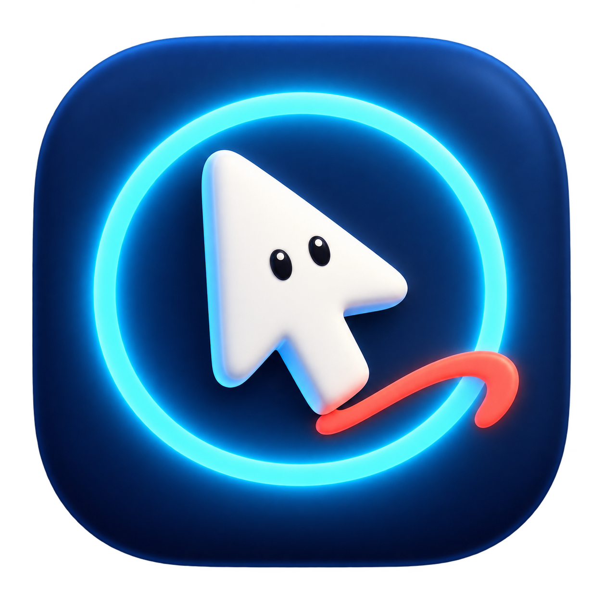

# 教學聚光燈 TeachingFocus



Mac 原生教學畫筆與聚光燈。目標：macOS 13+、Apple Silicon。Windows 不在本次交付範圍。

## 啟動

建議先到 GitHub Releases 下載 PKG，使用安裝精靈安裝至 `/Applications/TeachingFocus.app` 後開啟；選單列出現雙圈游標圖示。可將 app 複製至「應用程式」後固定使用，避免更換路徑造成權限需要重設。

首次使用到「系統設定 → 隱私權與安全性」允許本 app 的「輔助使用」與「螢幕錄製」（部分系統名稱包含系統音訊）；本程式不擷取音訊。授權後請退出並重新開啟。選單列「權限與使用說明」可開啟對應設定。

這是本機 ad-hoc 簽章版，尚未 Developer ID 簽章及公證。其他 Mac 可能需要在系統設定「隱私權與安全性」允許開啟；不要關閉系統安全機制。

## 上課操作

1. 雙按 Control 開關聚光燈；也可用 Control＋Option＋S。
2. 游標移到欲講解的螢幕，按 Control＋Option＋D 凍結。
3. 點擊螢幕邊緣的懸浮球，展開面板後選畫筆、直線、箭頭、矩形、橢圓或雷射筆，再選色與粗細。
4. 數字 1–5 對應紅、藍、綠、黑、白；Command＋Z 復原，Command＋Shift＋Z 重做。
5. 「清除」只清除畫布；長按 Esc（預設 3 秒，可設 0.5～10 秒）或「結束講解」清除並返回即時畫面。短按 Esc 只收起展開的面板，不退出凍結。點面板外的第一次點擊也只收起面板，不畫線或點擊底下程式。
6. 回到即時畫面後，再點擊真正的按鈕。

凍結不會暫停背景影片或程式。每次凍結都是新畫布。懸浮球可拖曳，放開後貼齊左右邊緣並記住各螢幕的位置。延伸桌面只凍結游標所在螢幕。

## 設定

選單列「設定」提供半徑、遮暗程度、螢光線寬、發光強度、外框色、光圈與波紋開關。外框顏色與光圈顏色使用可見色塊及即時預覽，可在淺／深背景上確認效果；光圈半徑可調整 6～80 點，不透明度可調整 0～100%，預設 30%；實際畫面與預覽使用相同數值。快捷鍵使用錄製方式：點「錄製…」→ 按修飾鍵與按鍵 →「儲存」。按 Esc 或取消不會改設定；與另一功能重複、或 macOS 註冊失敗時會提示。可停用雙按 Control，改用自訂組合鍵。

「長按 Esc」可設定 0.5～10 秒，預設 3 秒。只有凍結畫布或聚光燈啟用時會攔截 Esc；游標光圈與點擊波紋不會讓 Esc 進入退出倒數。

選單列提供「暫停／繼續」：暫停會清除畫布、關閉效果並停止攔截輸入，保留你的設定。繼續後不會自動恢復舊畫布。選單列只顯示雙圈游標圖示，暫停時淡化，不再顯示「教學」文字。

聚光燈收縮動畫可調整 0.1～1 秒，預設 0.25 秒，設定頁提供預覽，可關閉；系統啟用「減少動態效果」時自動略過。設定畫面也會顯示雙按 Control／滑鼠監聽是否正常。

預設半徑 120 邏輯點、遮暗 60%、青藍外框 3 點、外暈 12 點；設定保存在 macOS UserDefaults。

## 建置與測試

需要 Apple Command Line Tools / Swift 5.9 或以上：

```sh
./scripts/build-app.sh
```

腳本編譯 arm64 release、在 `.build/artifacts` 建立 `.app`、進行本機簽章驗證並執行 CoreChecks。CoreChecks 使用獨立 executable 測試框架，因此不依賴 XCTest 執行環境。執行 `./scripts/test.sh` 可重跑核心及繪圖測試；加上 `--live` 可檢查真實畫面擷取。

## 隱私與限制

畫面只存記憶體，退出凍結即釋放，不寫入磁碟、不上傳。受保護影片或系統安全畫面可能無法擷取；線上會議若只分享單一應用程式視窗，不一定包含本工具覆蓋層，請分享整個螢幕並先試播。

## GitHub 預覽版本

Repository：<https://github.com/polarbear0827/teaching-focus>（公開）。

下載：<https://github.com/polarbear0827/teaching-focus/releases>。下載 `TeachingFocus-v1.0.0-beta.7-arm64.pkg`，安裝精靈將程式放入 `/Applications/TeachingFocus.app`。本版不需要額外安裝背景服務，套件不包含安裝腳本；系統安裝精靈可能要求管理者授權。

目前為 `v1.0.0-beta.7` 預覽版。**PKG 本身未簽署；內含 app 只有 ad-hoc 本機簽章。尚未 Developer ID 簽署或 Apple 公證，app 的 Gatekeeper 評估為 rejected。**若系統阻擋，確認來源與 SHA-256 後，可由使用者在系統設定依 macOS 提示允許開啟；不要停用 Gatekeeper。

本版已加入無文字游標角色與螢光聚光燈 icon。

建立 PKG：先執行 `./scripts/build-app.sh`，再執行 `./scripts/build-pkg.sh`。可用環境變數 `TEACHINGFOCUS_APP_PATH` 指定 app 路徑、`TEACHINGFOCUS_PKG_PATH` 指定 PKG 輸出路徑。

更新尚未正式簽署的版本後，macOS 可能需要重新綁定 `/Applications/TeachingFocus.app` 的輔助使用／螢幕錄製權限。組合快捷鍵由系統註冊；雙按 Control、Esc 攔截與點擊波紋仍需要輔助使用授權。

設定頁提供「還原預設設定…」：確認後還原顏色、大小、效果開關、快捷鍵與 Esc 時間，並清除目前畫布。保留暫停狀態與 macOS 系統權限。

## 點擊粒子與懸浮工具

點擊粒子提供光點擴散、短線火花及小星芒，可獨立開關、設定五級強度，預設關閉、強度 2。一般操作的左右鍵點擊觸發，顏色沿用外框色；凍結繪圖及控制面板操作不觸發。最多同時保留八組粒子，淡出後釋放，系統「減少動態效果」啟用時不飛散，原有漣漪可繼續使用。

只有凍結講解時才顯示 44 點懸浮球，點球在旁邊展開工具面板；選工具、顏色、粗細不會自動收起，方便一次調整。再次點球、按收起、短按 Esc 或點面板外可收合。拖曳門檻為 4 點，位置限制在同一張凍結螢幕內。暫停、結束講解、螢幕配置變更或休眠時關閉面板與懸浮球；還原設定會重設球的位置及新增效果設定。
